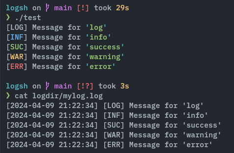

# LogSh

A simple log in bash.

```bash
#!/usr/bin/bash

log 'messge for log'
log suc 'messge for success log'
log inf 'messge for info log'
log war 'messge for warning log'
log err 'messge for error log'
```


